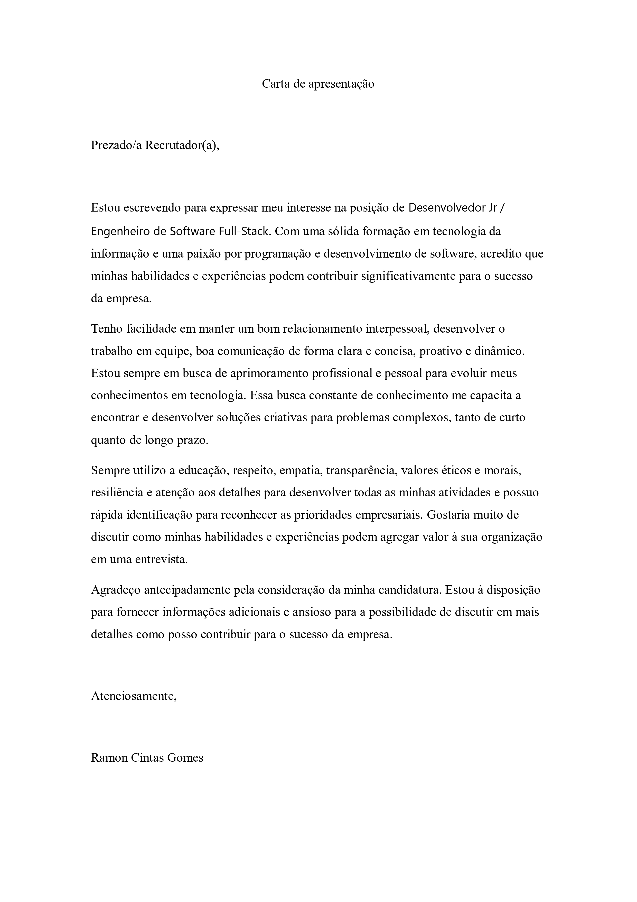

	<spam>Idiomas</spam>
	
  
  
  
  

<h1 align="center">🌐 Olá mundo, meu nome é Ramon Cintas Gomes 👋   🏁 Bem-vindo ao meu portfólio digital</h1>

	

<h3 align="center">🚀 Desenvolvedor Jr • Engenheiro de Software Full-Stack </h3>

 
	
	
	 

---

<h3 align="center">👨‍💻 Fluente em linguagens de programação e nunca parando de aprender 👨‍🎓</h3>

[+ao+meu+portfólio)](https://www.linkedin.com/in/ramon-cg/)

---

 
  
<b>🎯 Apresentação</b>

	 
	
	 

---

 
  
<b>📊 Estatísticas e atividades</b>

	 
	
 
		</a>
  		
  		</a>
		</a>
	

---

<table>
	<thead>
		<tr >
			<th colspan="2" width="2000"><h3>📘 Principais Projetos</h3></th>
		</tr>
	</thead>
	<tbody>
		<tr>
			<td align="center" valign="center" width="200" height="200"> 
				
		      	</td>
			<td valign="top">
				<h3 align="center">PetsCare</h3>
				
⚡ Projeto das disciplinas de dispositivos móveis II + Projeto Integrador + Projeto Interdisciplinar da Fatec.

				
	    			
				
			</td>
		</tr>
		<tr>
			<td align="center" valign="center" width="200" height="200"> 
				
		      	</td>
			<td valign="top">
				<h3 align="center">API CRUD Doações online</h3>
				
⚡ Projeto Interdisciplinar da Fatec.

				
				
			</td>
		</tr>
  <tr>
			<td align="center" valign="center" width="200" height="200"> 
				
		      	</td>
			<td valign="top">
				<h3 align="center">Find-Pets</h3>
				
⚡ Projeto da disciplina de Projeto Integrador I, II, III, IV da Fatec.

				
				
			</td>
		</tr>
	</tbody>
</table>

<table>
	<thead>
		<tr>
			<th colspan="4" width="2000"><h3>📖 Demais Projetos</h3></th>
		</tr>
	</thead>
	<tbody>
		<tr>
			<th align="center" valign="center" >
				
		      	</th>
			<th align="center" valign="center" >
				
			</th>
			<th align="center" valign="center" >
				
			</th>
			<th align="center" valign="center" >
				
			</th>
		</tr>
		<tr>
			<th align="center" valign="center" width="200" height="200">
				<h3 align="center">(Fatec) Faculdade de Tecnologia do Estado de São Paulo</h3>
		      	</th>
			<th align="center" valign="center" width="200" height="200">
				<h3 align="center">(DIO) Digital Innovation One</h3>
			</th>
			<th align="center" valign="center" width="200" height="200">
				<h3 align="center">Desafios de Programação</h3>
			</th>
			<th align="center" valign="center" width="200" height="200">
				<h3>Organização Ramon Cintas Gomes</h3>
			</th>
		</tr>
		<tr>
			<th align="center" valign="center" width="200" height="200">
				
⚡ Projetos desenvolvidos no curso tecnólogo em ADS (Análise e desenvolvimento de sistemas) na instituição de ensino superior Fatec

		      	</th>
			<th align="center" valign="center" width="200" height="200">
				
⚡ Projetos desenvolvidos na plataforma de ensino de tecnologias da Digital Innovation One

			</th>
			<th align="center" valign="center" width="200" height="200">
				
⚡ Projetos desenvolvidos nas plataformas de desafios de código

			</th>
			<th align="center" valign="center" width="200" height="200">
				
⚡ Organização usada para forks de repositórios

			</th>
		</tr>
		<tr>
			<th align="center" valign="center" width="200" height="200">
    				
				
			 	
		      	</th>
			<th align="center" valign="center" width="200" height="200">
				
				
				
			</th>
			<th align="center" valign="center" width="200" height="200">
				
				
			</th>
			<th align="center" valign="center" width="200" height="200">
				
			</th>
		</tr>
	</tbody>
</table>

---

 

  <b align="centre"><b>Visitas recebidas no perfil</b>
  
  

 

	  

