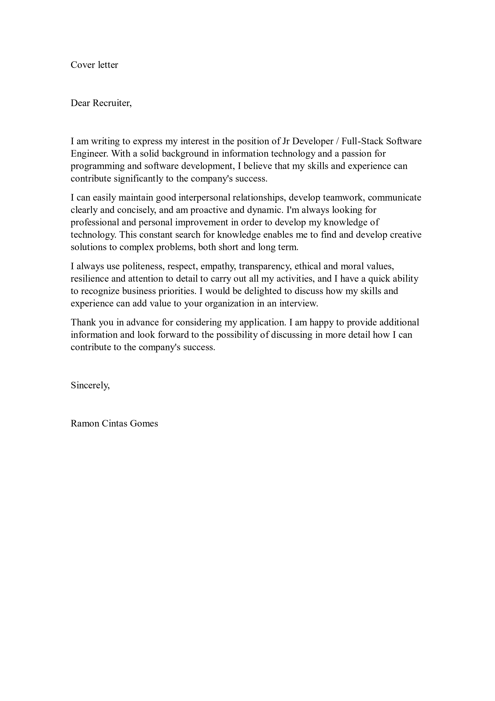

	<spam>Languages</spam>
	
  
  
  
  

<h1 align="center">🌐 Hello world, my name is Ramon Cintas Gomes 👋   🏁 Welcome to my digital portfolio</h1>

	

<h3 align="center">🚀 Jr Developer - Full-Stack Software Engineer </h3>

 
	
	
	 

---

<h3 align="center">👨‍💻 Fluent in programming languages and never stops learning 👨‍🎓</h3>

---

 
  
<b>🎯 Presentation</b>

	 
	
	 

---

 
  
<b>📊 Statistics and activities</b>

	 
	
 
		</a>
  		
  		</a>
		</a>
	

---

<table>
	<thead>
		<tr >
			<th colspan="2" width="2000"><h3>📘 Main Projects</h3></th>
		</tr>
	</thead>
	<tbody>
		<tr>
			<td align="center" valign="center" width="200" height="200"> 
				
		      	</td>
			<td valign="top">
				<h3 align="center">PetsCare</h3>
				
⚡ Project for mobile devices II + Integrating Project + Interdisciplinary Project at Fatec.

				
	    			
				
			</td>
		</tr>
		<tr>
			<td align="center" valign="center" width="200" height="200"> 
				
		      	</td>
			<td valign="top">
				<h3 align="center">API CRUD Online donations</h3>
				
⚡ Fatec Interdisciplinary Project.

				
				
			</td>
		</tr>
  <tr>
			<td align="center" valign="center" width="200" height="200"> 
				
		      	</td>
			<td valign="top">
				<h3 align="center">Find-Pets</h3>
				
⚡ Project for the Integrating Project I, II, III, IV course at Fatec.

				
				
			</td>
		</tr>
	</tbody>
</table>

<table>
	<thead>
		<tr>
			<th colspan="4" width="2000"><h3>📖 Other projects</h3></th>
		</tr>
	</thead>
	<tbody>
		<tr>
			<th align="center" valign="center" >
				
		      	</th>
			<th align="center" valign="center" >
				
			</th>
			<th align="center" valign="center" >
				
			</th>
			<th align="center" valign="center" >
				
			</th>
		</tr>
		<tr>
			<th align="center" valign="center" width="200" height="200">
				<h3 align="center">(Fatec) Faculdade de Tecnologia do Estado de São Paulo</h3>
		      	</th>
			<th align="center" valign="center" width="200" height="200">
				<h3 align="center">(DIO) Digital Innovation One</h3>
			</th>
			<th align="center" valign="center" width="200" height="200">
				<h3 align="center">Programming Challenges</h3>
			</th>
			<th align="center" valign="center" width="200" height="200">
				<h3>Organization Ramon Cintas Gomes</h3>
			</th>
		</tr>
		<tr>
			<th align="center" valign="center" width="200" height="200">
				
⚡ Projects developed in the ADS (Systems Analysis and Development) technology course at the Fatec higher education institution

		      	</th>
			<th align="center" valign="center" width="200" height="200">
				
⚡ Projects developed on Digital Innovation One's technology teaching platform

			</th>
			<th align="center" valign="center" width="200" height="200">
				
⚡ Projects developed on code challenge platforms

			</th>
			<th align="center" valign="center" width="200" height="200">
				
⚡ Organization used for repository forks

			</th>
		</tr>
		<tr>
			<th align="center" valign="center" width="200" height="200">
    				
				
			 	
		      	</th>
			<th align="center" valign="center" width="200" height="200">
				
				
				
			</th>
			<th align="center" valign="center" width="200" height="200">
				
				
			</th>
			<th align="center" valign="center" width="200" height="200">
				
			</th>
		</tr>
	</tbody>
</table>

---

 

  <b align="centre"><b>Visits received on profile</b>
  
  

 

	  

