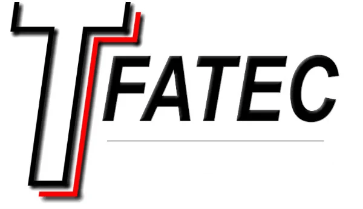

	<spam>Languages</spam>
	
  
  
  
  

	<h3>📘 Main Projects</h3>
	 
	

 

 
	

---

<table>
	<thead>
		<tr>
			<th colspan="4" width="2000"><h3>📖 Other projects</h3></th>
		</tr>
	</thead>
	<tbody>
		<tr>
			<th align="center" valign="center" >
				
		      	</th>
			<th align="center" valign="center" >
				
			</th>
			<th align="center" valign="center" >
				
			</th>
			<th align="center" valign="center" >
				
			</th>
		</tr>
		<tr>
			<th align="center" valign="center" width="200" height="200">
				<h3 align="center">(Fatec) Faculdade de Tecnologia do Estado de São Paulo</h3>
		      	</th>
			<th align="center" valign="center" width="200" height="200">
				<h3 align="center">(DIO) Digital Innovation One</h3>
			</th>
			<th align="center" valign="center" width="200" height="200">
				<h3 align="center">Programming Challenges</h3>
			</th>
			<th align="center" valign="center" width="200" height="200">
				<h3>Organization Ramon Cintas Gomes</h3>
			</th>
		</tr>
		<tr>
			<th align="center" valign="center" width="200" height="200">
				
⚡ Projects developed in the ADS (Systems Analysis and Development) technology course at the Fatec higher education institution

		      	</th>
			<th align="center" valign="center" width="200" height="200">
				
⚡ Projects developed on Digital Innovation One's technology teaching platform

			</th>
			<th align="center" valign="center" width="200" height="200">
				
⚡ Projects developed on code challenge platforms

			</th>
			<th align="center" valign="center" width="200" height="200">
				
⚡ Organization used for repository forks

			</th>
		</tr>
		<tr>
			<th align="center" valign="center" width="200" height="200">
    				 
				 
			 	 
				 
				 
				
				 
				
		      	</th>
			<th align="center" valign="center" width="200" height="200">
				
				
				
			</th>
			<th align="center" valign="center" width="200" height="200">
				
				
			</th>
			<th align="center" valign="center" width="200" height="200">
				
			</th>
		</tr>
	</tbody>
</table>

---

  

---

---
